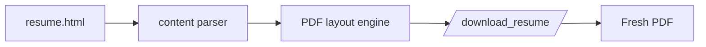

<div align="center">


<br />

<a href="https://www.yali.website">
  
</a>
<a href="https://www.yali.website/download_resume/">
  
</a>


<br />
<br />

<strong>A builder at heart.</strong><br />
Navigating the intersection of hardware modding, network defense, and self-hosted systems.

</div>

---

## Snapshot

```text
yali@homelab:~$ whoami
Infrastructure-minded builder, SOC analyst, hardware tinkerer.

yali@homelab:~$ current-focus
Network defense | Linux servers | Docker | ESPHome | practical electronics

yali@homelab:~$ philosophy
If I cannot explain how it works, I have not earned the right to run it.
```

## Experience

<table>
  <tr>
    <td width="28%"><strong>Cyber Security Analyst</strong><br /><sub>IDF · ongoing</sub></td>
    <td>
      Junior SOC analyst focused on real-time network monitoring, vulnerability identification,
      and maintaining digital infrastructure integrity. The work has sharpened my operational
      discipline, incident response instincts, and understanding of the technical why behind defense.
    </td>
  </tr>
  <tr>
    <td><strong>Service &amp; Operations</strong><br /><sub>Niro Cafe · 2022-2024</sub></td>
    <td>
      Running a busy cafe floor taught me to stay calm when everything goes sideways at once.
      Turns out that skill travels well.
    </td>
  </tr>
</table>

## Projects

<table>
  <tr>
    <td width="33%">
      <h3>The NFC Jukebox</h3>
      <p><code>ESP32 / IoT</code></p>
      <p>Tap a card, play an album. RC522 reader, ESPHome, Home Assistant, MQTT, and Spotify automation.</p>
    </td>
    <td width="33%">
      <h3>Homelab Architecture</h3>
      <p><code>Linux / Docker</code></p>
      <p>Private cloud at home: Immich, AdGuard, containerised services, and a lot of learning through breakage.</p>
    </td>
    <td width="33%">
      <h3>Horology &amp; Modding</h3>
      <p><code>Hardware precision</code></p>
      <p>Custom NH35 movement assembly and regulation. Tiny tolerances, patient hands, practical electronics mindset.</p>
    </td>
  </tr>
</table>

## Stack

<p>
  
  
  
  
  
  
  
  
</p>

## How The Resume PDF Works

The download endpoint does not serve a stale file. It renders the website template, extracts the resume content, and generates a styled PDF on demand.



## Repository Map

```text
core/
  templates/resume.html   website resume content
  views.py                homepage and download route
  pdf.py                  dynamic styled PDF generator
resume_project/
  settings.py             Django settings
  urls.py                 URL routes
vercel.json               Vercel deployment config
```

## Local Development

```bash
python3 -m venv .venv
source .venv/bin/activate
pip install -r requirements.txt
python manage.py runserver
```

Open:

```text
http://127.0.0.1:8000/
http://127.0.0.1:8000/download_resume/
```

---

<div align="center">

<sub>built with curiosity</sub>

<br />
<br />


</div>
