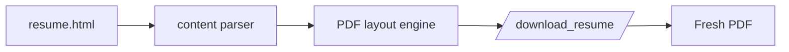

<div align="center">

<sub>Infrastructure &amp; Electronics</sub>

# Yali Tal

<br />
<br />

<strong>A builder at heart.</strong><br />
Navigating the intersection of hardware modding, network defense, and self-hosted systems.

<br />

<a href="https://www.yali.website"><strong>Website</strong></a>
&nbsp;&nbsp;·&nbsp;&nbsp;
<a href="https://www.yali.website/download_resume/"><strong>Live PDF</strong></a>

<br />
<br />

<code>network defense</code>
<code>linux servers</code>
<code>docker</code>
<code>electronics</code>
<code>homelab</code>

</div>

---

## Snapshot

```text
yali@homelab:~$ whoami
Infrastructure-minded builder, SOC analyst, hardware tinkerer.

yali@homelab:~$ current-focus
Network defense | Linux servers | Docker | ESPHome | practical electronics

yali@homelab:~$ philosophy
If I cannot explain how it works, I have not earned the right to run it.
```

## Experience

<table>
  <tr>
    <td width="28%"><strong>Cyber Security Analyst</strong><br /><sub>IDF · ongoing</sub></td>
    <td>
      Junior SOC analyst focused on real-time network monitoring, vulnerability identification,
      and maintaining digital infrastructure integrity. The work has sharpened my operational
      discipline, incident response instincts, and understanding of the technical why behind defense.
    </td>
  </tr>
  <tr>
    <td><strong>Service &amp; Operations</strong><br /><sub>Niro Cafe · 2022-2024</sub></td>
    <td>
      Running a busy cafe floor taught me to stay calm when everything goes sideways at once.
      Turns out that skill travels well.
    </td>
  </tr>
</table>

## Projects

<table>
  <tr>
    <td width="33%">
      <h3>The NFC Jukebox</h3>
      <p><code>ESP32 / IoT</code></p>
      <p>Tap a card, play an album. RC522 reader, ESPHome, Home Assistant, MQTT, and Spotify automation.</p>
    </td>
    <td width="33%">
      <h3>Homelab Architecture</h3>
      <p><code>Linux / Docker</code></p>
      <p>Private cloud at home: Immich, AdGuard, containerised services, and a lot of learning through breakage.</p>
    </td>
    <td width="33%">
      <h3>Horology &amp; Modding</h3>
      <p><code>Hardware precision</code></p>
      <p>Custom NH35 movement assembly and regulation. Tiny tolerances, patient hands, practical electronics mindset.</p>
    </td>
  </tr>
</table>

## Stack

`Ubuntu Server` `Docker` `ESPHome` `Home Assistant` `Django` `Vercel` `PC Assembly` `Soldering`

## How The Resume PDF Works

The download endpoint does not serve a stale file. It renders the website template, extracts the resume content, and generates a styled PDF on demand.



<div align="center">

<sub>built with curiosity</sub>

</div>
